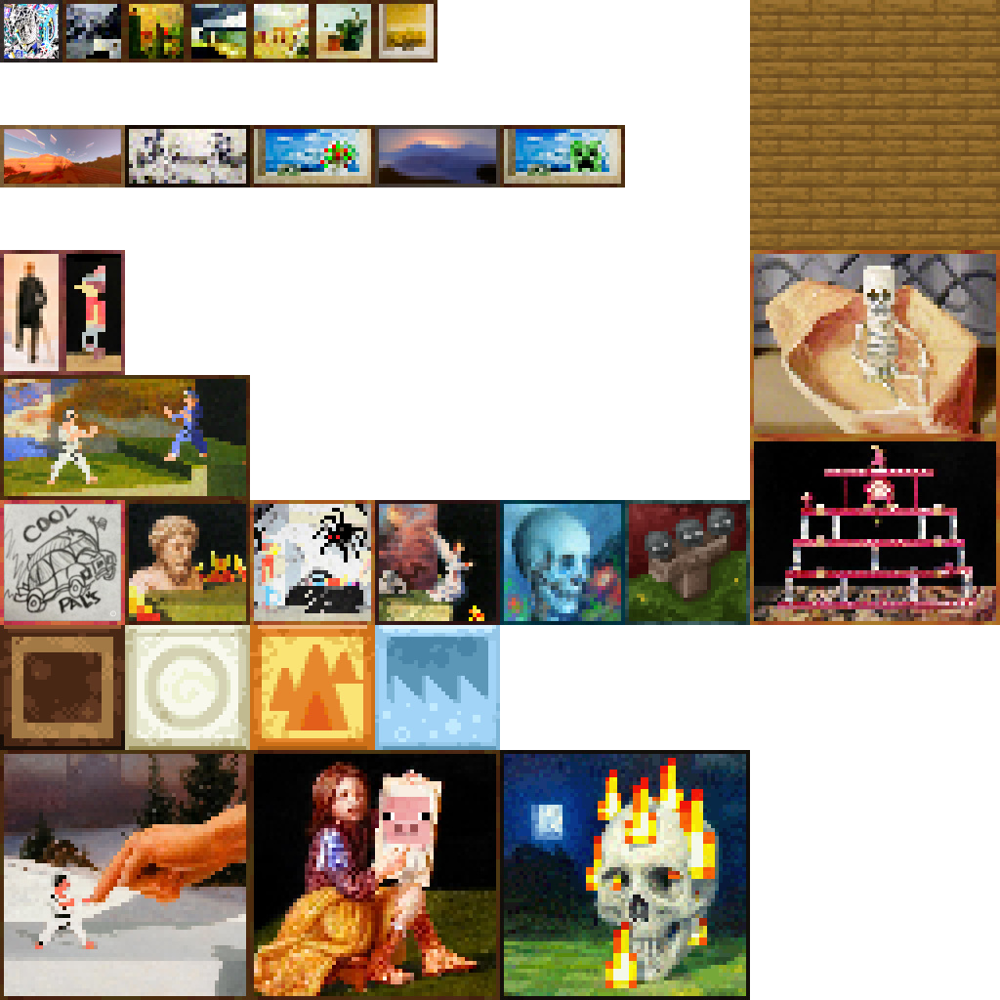

# CPC Credits
[I did](https://github.com/tulip-bph/) the textures and programming.

## Paintings
*note to myself for later: The inset shadows are black and 25% opacity.*

 - 1x1 paintings
   - *Gray Guy* by Green Circut
     - he put a photo of himself through an "anime" filter 11 times
 - 2x1 paintings
   - "yeaVerily" by Blainew0rld
     - the seed "yeaVerily" with the resource pack *Vanilla RTX Normals*
 - 2x2 paintings
   - *Cool Pals Car* by RobinGlizard
     - drawn long ago with pencil on paper as the Cool Pals group chat icon

## Special Thanks
 - Blockception Ltd for their, albeit imperfect,
   [VS Code extension](https://marketplace.visualstudio.com/items?itemName=BlockceptionLtd.blockceptionvscodeminecraftbedrockdevelopmentextension)
 - Hive Games for their [world conversion tool](https://chunker.app/)
   that let me update block IDs
 - the various people whose work I referenced to learn how to do this
